# Open Workplace Health Standard (OWHS), v0.1 draft schema

**Status:** design draft for discussion · UK English · normative artefact is plain JSON Schema (Draft 2020-12) · FHIR profiles are a stated v1.x direction. This document is the schema design responding to the OWHS v0.1 scope draft; it takes the scope draft's six design principles as fixed constraints and does not restate them. Spec text is offered CC-BY 4.0; schemas, examples and validator Apache-2.0.

**What is machine-checked in this draft.** The three worked JSON Schemas meta-validate as Draft 2020-12; each valid example instance passes with zero errors and each invalid instance raises exactly the errors the error map names. Results: [`validation_report.json`](examples/validation_report.json). Everything else (field tables, code lists, profile/identity/conformance prose) is design specification, not executed code.

**Primary-source anchors** (every definitional choice cites one): sickness-absence semantics, 7.5-hour day and reason taxonomy → **ONS, *Sickness absence in the UK labour market: 2025*** [1][10][26]; psychosocial domains → **HSE Management Standards** six domains [19] + MSIT [17]; RTW adjustment vocabulary → **Statement of Fitness for Work (fit note)** "may be fit" categories; statutory benefit entitlement → **Statutory Sick Pay (SSP)**; reasonable adjustments → **Equality Act 2010 s.20**; optional clinical coding → **SNOMED CT** (affiliate-licence caveat, never conformance-required); reserved national definitions → **Workplace Health Intelligence Unit (WHIU)** `whiu:` namespace [31][34]. No licensed instrument item text is reproduced anywhere in this standard.

**A standing choice, stated once:** where elegance and SME-implementability conflict, this draft chooses SME-implementability and says so at the point of choice (most visibly in the pseudonymisation design, §2f, and the strict-closure schema, §3.1.6).

**An open invitation, stated once:** the two domains where OWHS invents most, return-to-work outcomes and disability participation, are offered as good-faith strawmen, not settled designs. The people best placed to break them are insurer vocational-rehabilitation and analytics teams, occupational-health providers, disability-data specialists, and in time the WHIU itself. Comment on these two constructs is explicitly invited and will be weighted accordingly; both carry reserved `whiu:` escape hatches, so adopting a better definition is a code-list revision, not a schema break.

---

## Contents

1. [Scope and domain coverage](#scope-and-domain-coverage): what an SME holds, and where each domain goes
2. The schema: [entity catalogue + ERD](#entity-catalogue) · [privacy profile](#the-privacy-profile-normative) · [field tables](#field-tables-entity-by-entity) · [code lists](#code-lists) · [schemas + validation](#json-schemas-and-validation) · [profile mechanism](#the-profile-mechanism) · [identifiers and pseudonymisation](#identifiers-and-pseudonymisation) · [conformance levels](#conformance-levels)
3. [The honesty pass](#the-honesty-pass-disputable-decisions-and-open-questions): the decisions reasonable people would dispute, and the open questions

---

## 1. Scope and domain coverage

This sweep enumerates the workplace-health data a UK SME could hold or need, beyond the entities already in the scope draft, and routes each domain to one of four homes: **core v0.1** (vendor-neutral, every broker/HRIS/OH provider recognises it), a **named profile** (real but specialised or vendor-shaped), a **reserved entity** (too central to omit, too undefined to model now), or **out of scope** for v0.1. The full routing table is not included in this release; the reasoning and the two genuinely hard calls follow.

### 1.1 Routing summary

| Domain | SME prevalence | Privacy | Route | Home |
|---|---|---|---|---|
| Occupational-health referral & assessment | common | high | **core v0.1** | `OHEpisode` |
| Fitness-for-work opinion | common | high | **core v0.1** | `OHEpisode.opinion` |
| Reasonable adjustments (Equality Act 2010) | common | high | **core v0.1** | `ReasonableAdjustment` |
| EAP / counselling provision & utilisation | common | med to high | **core v0.1** | `BenefitEntitlement` / `BenefitUtilisation` |
| Wellbeing interventions + outcomes | common | low to med | **core v0.1** | `BenefitEntitlement` + `AggregateReport` |
| Ill-health retirement / medical capability exit | occasional | high | **core v0.1** | `ReturnToWorkOutcome` value |
| Psychosocial risk assessment (HSE MS / ISO 45003) | common | low | **core v0.1** | `Crosswalk` + reserved `RiskAssessment` |
| Statutory health surveillance (COSHH/Noise/HAVS…) | niche | high | **named profile** | `owhs-ohsurveillance` |
| MSK / physiotherapy pathway | common | med | **named profile** | `owhs-msk` |
| Occupational immunisation / pre-placement screening | niche | high | **named profile** | `owhs-ohsurveillance` |
| DSE / workstation assessment | common | low | **reserved entity** | `RiskAssessment` |
| Accident / injury record & RIDDOR reportability | common | med | **reserved entity** | `WorkplaceIncident` |
| Vaccinations & health checks (general) | niche | high | **out of scope** | |
| Drug & alcohol testing | niche | high | **out of scope** | |
| Flexible-working requests (statutory) | common | low | **out of scope** | |
| Absence triggers / Bradford-factor scoring | common | med | **out of scope** | |
| First-aid provision & needs assessment | universal | low | **out of scope** | |

### 1.2 Occupational health: why `OHEpisode` is core, and its shape

Occupational health is the domain the brief singles out, and rightly: OH data sits closer to a clinical record than anything already in scope, which is exactly why its shape has to be argued rather than assumed.

**Why core, not a profile.** An SME does not run a standing OH department; it buys OH *ad hoc* for precisely the cases the rest of the standard is about, a long-term absence that needs a fitness opinion before return, a disability that needs adjustments recommending, a manager who needs to know whether an employee can safely do a task. The OH referral and its resulting **fitness-for-work opinion** are the operational hinge between `AbsenceEpisode`, `ReturnToWorkOutcome` and `ReasonableAdjustment`. A competitor OH provider, an HRIS with an OH-referral module, and an insurer's rehabilitation service would all recognise "referral → assessment → fitness opinion → recommendations" as their concept. That passes the litmus test for core.

**What core deliberately excludes.** Everything that makes OH *clinical* stays out: no diagnosis, no history, no test results, no report narrative. `OHEpisode` models the **management-facing envelope** of an OH interaction, that a referral happened, why (from a controlled reason list), what assessment type occurred, and the categorical fitness opinion and recommendation *types*, not the clinical content the OH clinician holds under medical confidentiality. The distinction mirrors real UK practice: under the Access to Medical Reports Act 1988 and GMC guidance the OH physician's report goes to the worker first and to the employer only with consent, and the employer legitimately receives the *opinion and recommendations*, not the clinical detail. The schema encodes only what the employer is already entitled to hold.

**The privacy problem OH forces, and the resolution.** The scope draft's privacy profile is aggregate-first: employer-visible values must clear an n≥5 floor. But a fitness-for-work opinion is intrinsically **individual and legitimately employer-visible**, a manager must know *this named worker* may return on altered hours. An aggregate-only rule would make the entity useless, yet dropping the floor would breach the profile. The resolution is a **fourth visibility class**, `individual-employer`, defined narrowly: a value an employer may hold about an identifiable worker **only** where an independent legal basis already entitles them to it (statutory adjustment duty, an OH opinion the worker's report has released, a return-to-work plan the worker is party to). It is not a licence to hold clinical data; it is an honest acknowledgement that adjustments and fitness opinions are individual by nature and were never aggregate. Every `individual-employer` field is enumerated in the privacy profile and is the *only* class exempt from the aggregation floor, and note that within an OWHS payload the "identifiable worker" is still a `WorkerPseudonym`, never a direct identifier. This is the single most disputable decision in the design and is carried into the honesty pass (the honesty pass (section 10)) unsmoothed.

### 1.3 The other calls, briefly

- **Reasonable adjustments → core.** The Equality Act 2010 duty to make reasonable adjustments binds employers of any size; adjustments are the connective tissue between disability participation and RTW. Modelling them as a first-class `ReasonableAdjustment` entity (rather than a flag on RTW) lets a standing adjustment (e.g. a permanent equipment change) exist independently of any absence. Individual-employer visibility, same basis as OH.
- **EAP, counselling, wellbeing interventions → existing benefit entities.** These are *services*; provision is a `BenefitEntitlement` with an EAP/intervention product category and a health-domain tag, and uptake is `BenefitUtilisation` aggregate counts. No new entity, and individual counselling attendance stays firmly `individual-never`.
- **Ill-health retirement / medical capability exit → an RTW value, not an entity.** Adding `ill-health-exit` as a `did-not-return` subtype stops medical exits from disappearing into an undifferentiated "did not return", which matters for the disability-participation picture.
- **Statutory health surveillance, occupational immunisation, MSK pathway → named profiles.** Real, but either sector-mandated for exposures most office SMEs never have (surveillance, immunisation) or vendor-shaped in its detail (MSK triage tiers). Profiles keep the core uncluttered; a 12-person marketing agency implements none of them.
- **DSE assessment, accident/RIDDOR record → reserved entities.** DSE is near-universal but is a *workstation risk-assessment* artefact; a RIDDOR-reportable injury already surfaces via the work-relatedness flag on `AbsenceEpisode`, and a full incident record duplicates the employer's separate statutory report to HSE. Reserve `RiskAssessment` and `WorkplaceIncident` as names, model neither in v0.1.
- **Vaccinations/health checks, drug & alcohol testing, flexible-working requests, Bradford-factor triggers, first aid → out of scope.** Each is either a clinical event inviting diagnosis semantics, a near-forensic sector process, an HR-admin flow, derived management logic, or facilities compliance, none is an SME workplace-health *record* that a national benchmark needs, and several carry privacy risk with no offsetting benchmarking value. Where a health consequence exists it already surfaces elsewhere (a health-driven flexible-working change is a `ReasonableAdjustment`; a testing-related absence is just an `AbsenceEpisode`).

**Net effect on the entity set:** two new core entities (`OHEpisode`, `ReasonableAdjustment`), one new RTW outcome value (`ill-health-exit`), two reserved entities (`RiskAssessment`, `WorkplaceIncident`), and two named profiles (`owhs-ohsurveillance`, `owhs-msk`) alongside the steward's own profile already anticipated by the scope draft.


---

## 2. Entity catalogue

Sixteen entities in five clusters, plus two reserved names and one code-list-backed shared entity. New in v0.1 relative to the scope draft: `OHEpisode`, `ReasonableAdjustment` (both core), `ConstructDomain` promoted to an explicit shared entity, and the reserved `RiskAssessment` / `WorkplaceIncident`. Cardinalities read "parent : child".

### Identity cluster

| Entity | Purpose | Cardinality | Key relationships |
|---|---|---|---|
| `Organisation` | The employer; the outer boundary of every pseudonym scope. | root | 1:N `OrgUnit`, 1:N `WorkerPseudonym`, 1:N `BenefitEntitlement`, 1:N `DisabilityParticipation` |
| `OrgUnit` | Team/department; the smallest unit an aggregate may describe. | Organisation 1:N | parent-ref self-join; scopes `AggregateReport` |
| `WorkerPseudonym` | Opaque, per-employer person reference carrying banded demographics only, never a direct identifier. | Organisation 1:N | subject of all individual-level records |

### Measurement cluster

| Entity | Purpose | Cardinality | Key relationships |
|---|---|---|---|
| `WellbeingObservation` | One answer to one survey item on one occasion, any vendor. | WorkerPseudonym 1:N | → `ConstructDomain`, → `MeasurementContext` |
| `InstrumentAdministration` | One completed validated instrument (scores + band, never item text). | WorkerPseudonym 1:N | → `ConstructDomain`, → `MeasurementContext` |
| `MeasurementContext` | What makes scores comparable: producing system, scoring descriptor, window, limitations. | referenced N:1 | referenced by observations, administrations, reports |

### Absence, RTW & occupational-health cluster

| Entity | Purpose | Cardinality | Key relationships |
|---|---|---|---|
| `AbsenceEpisode` | One episode of sickness absence, ONS-comparable. | WorkerPseudonym 1:N | 1:0..1 `ReturnToWorkOutcome` |
| `ReturnToWorkOutcome` | What happened after an absence (incl. `did-not-return` / `ill-health-exit`). | AbsenceEpisode 1:0..1 | informed by `OHEpisode`, enacted via `ReasonableAdjustment` |
| `OHEpisode` | Management-facing envelope of an OH referral → assessment → fitness opinion (no clinical content). | WorkerPseudonym 1:N | recommends `ReasonableAdjustment`, informs `ReturnToWorkOutcome` |
| `ReasonableAdjustment` | A workplace adjustment (Equality Act 2010 s.20 duty), standing or absence-linked. | WorkerPseudonym 1:N | recommended by `OHEpisode`, enacted in `ReturnToWorkOutcome` |

### Benefits cluster

| Entity | Purpose | Cardinality | Key relationships |
|---|---|---|---|
| `BenefitEntitlement` | What support the workforce has: statutory (SSP) + commercial (product category). | Organisation 1:N | N:M `ConstructDomain` (health-domain tags) |
| `BenefitUtilisation` | Aggregate usage/claims counts per service per period, never individual claims. | BenefitEntitlement 1:N | aggregated into `AggregateReport` |

### Disability participation

| Entity | Purpose | Cardinality | Key relationships |
|---|---|---|---|
| `DisabilityParticipation` | Reserved WHIU third metric; aggregate-only, org level, banded counts, n≥10 floor, minimal until the WHIU defines its measure. | Organisation 1:N | |

### Reporting cluster

| Entity | Purpose | Cardinality | Key relationships |
|---|---|---|---|
| `AggregateReport` | The **only** way individual-level results leave an org: level, n, completion, value+interval, suppression metadata. | OrgUnit N:1 | ← all aggregable entities; → `MeasurementContext` |
| `BenchmarkRelease` | A published comparison set with composition disclosure and leave-one-out flag. | N:M `AggregateReport` | |
| `Crosswalk` | Construct → HSE MS domain → ISO 45003 clause → `whiu:` reserved mapping; versioned independently. | maps `ConstructDomain` | |

### Shared & reserved

| Entity | Purpose | Status |
|---|---|---|
| `ConstructDomain` | The single health-domain vocabulary used by **both** measurement (what a survey measures) and services (what a benefit targets). | Code-list-backed shared entity |
| `RiskAssessment` | Reserved name for HSE-MS/ISO-45003/DSE assessment events. | Reserved, no fields in v0.1 |
| `WorkplaceIncident` | Reserved name for accident/RIDDOR records. | Reserved, no fields in v0.1 |

### Entity-relationship diagram

The Mermaid source is [`owhs_erd_v0.1.mmd`](diagrams/owhs_erd_v0.1.mmd) (renders natively in GitHub/Markdown); a static render is below. Solid lines are structural references; dotted lines are the aggregation flow into `AggregateReport`; dashed outlines are reserved names.



*Figure, the OWHS v0.1 entity map. White boxes are organisation-level entities; tinted boxes are individual-level records held against the pseudonym; filled boxes are the outputs that leave; grey boxes are shared definitions; dashed outlines are reserved names.*

## 3. The privacy profile (normative)

Restated here because §2b field tables reference it on every row. The scope draft's P1 to P5 stand; this draft adds the fourth visibility class made necessary by occupational health and adjustments (§1.2).

- **P1, no direct identifiers** in an OWHS payload; pseudonymous IDs and banded demographics only. What is enforced in schema (§2d): a direct identifier cannot be carried in a field of its own, because every entity and every nested object declares its permitted properties and rejects the rest. What is not enforced: an identifier written into the value of a permitted string field, such as a source-system provider name, is structurally valid. No schema keyword detects it. Producers MUST NOT place identifiers in free-text values, and that obligation is part of Level 3.
- **P2, aggregation floors:** employer-visible aggregates require n≥5, or n≥10 for severe-distress measures. Below the applicable floor a conformant producer emits suppression metadata instead of the value; it refuses to emit, not merely hides. The enumerated `individual-employer` fields are exempt under the independent-legal-basis condition below.
- **P3, visibility is a field-level property** with four classes: `open` / `aggregate-only` / `individual-employer` / `individual-never`. All instrument results are `individual-never` by definition.
- **P4, safeguarding-category signals** (bullying, harassment, discrimination, crisis) are excluded from employer-visible outputs entirely, **at any n**.
- **P5, completeness travels:** every aggregate carries its completion rate and suppression metadata.

**The fourth class, `individual-employer`,** applies only to fields an employer may lawfully hold about an identified *pseudonym* under an independent legal basis (Equality Act adjustment duty; a released OH opinion; an RTW plan the worker is party to). It is the **only** class exempt from the aggregation floor, is exhaustively enumerated in §2b, and never carries clinical content. The n≥5/n≥10 floors adopt commonly used conventions from UK official-statistics disclosure control (small cells suppressed, higher floors for sensitive measures); exact implementations vary across ONS and HSE outputs, sometimes with additional perturbation or dominance rules, so OWHS fixes these thresholds by convention rather than claiming to mirror any single official implementation.

---


---

## 4. Field tables, entity by entity

**Privacy classification (four classes).** `open` = may appear in any output; `aggregate-only` = employer-visible only through an `AggregateReport` clearing the n-floor; `individual-never` = never leaves the producer at individual grain in any output, even to the employer (all instrument results, all safeguarding-category signals); `individual-employer` = may be held/shown about an identified *pseudonym* to the employer **only** where an independent legal basis entitles them (Equality Act adjustment duty, a released OH opinion, an RTW plan the worker is party to). `individual-employer` is the only class exempt from the aggregation floor and every field carrying it is enumerated here and in the privacy profile (§3). Fields marked `open` are structural/metadata, not personal.

**Types** are JSON Schema types with a semantic note. `codelist:<name>@<ver>` marks a value drawn from a versioned code list (§2c). "Anchor" is the primary source fixing the field's *meaning*.

### Organisation

| Field | Type | Req | Code list | Privacy | Anchor |
|---|---|---|---|---|---|
| `orgId` | string (opaque) | ✓ | | open | OWHS internal |
| `companiesHouseNumber` | string | ○ | | open | Companies House |
| `sicCode` | string | ○ | codelist:sic-2007 | open | ONS SIC 2007 (sector comparability) |
| `sizeBand` | string | ✓ | codelist:org-size-band@0.1 | open | Companies Act 2006 micro/small/medium bands |
| `country` | string | ✓ | ISO 3166-1 alpha-2 | open | UK-first; structure allows extension |

### OrgUnit

| Field | Type | Req | Code list | Privacy | Anchor |
|---|---|---|---|---|---|
| `unitId` | string | ✓ | | open | OWHS internal |
| `orgId` | string (ref) | ✓ | | open | → Organisation |
| `parentUnitId` | string (ref) | ○ | | open | self-join |
| `headcountBand` | string | ✓ | codelist:headcount-band@0.1 | open | banded, never exact (small-cell control) |

### WorkerPseudonym

| Field | Type | Req | Code list | Privacy | Anchor |
|---|---|---|---|---|---|
| `pseudonymId` | string (opaque, per-org) | ✓ | | open | §2f pseudonymisation design |
| `orgId` | string (ref) | ✓ | | open | scope boundary |
| `unitId` | string (ref) | ○ | | open | → OrgUnit |
| `ageBand` | string | ○ | codelist:age-band@0.1 | aggregate-only | banded demographic (ONS age groups) |
| `tenureBand` | string | ○ | codelist:tenure-band@0.1 | aggregate-only | banded demographic |
| `workPattern` | string | ○ | codelist:work-pattern@0.1 | aggregate-only | full/part-time (ONS employment-type dimension) |
| **Forbidden** | |, | |, | name, NI number, email, DOB, address, schema MUST reject (§3 privacy) |

### AbsenceEpisode

| Field | Type | Req | Code list | Privacy | Anchor |
|---|---|---|---|---|---|
| `episodeId` | string | ✓ | | open | OWHS internal |
| `pseudonymId` | string (ref) | ✓ | | individual-employer | employer holds absence records lawfully |
| `reasonCode` | string | ✓ | codelist:absence-reason@0.1 | aggregate-only | **ONS reason taxonomy** [1] |
| `startDate` | string (date) | ✓ | | individual-employer | |
| `endDate` | string (date) | ○ | | individual-employer | open episode if absent |
| `workingDaysLost` | number | ○ | | aggregate-only | **ONS 7.5-hour working-day unit** [26] |
| `workingHoursLost` | number | ○ | | aggregate-only | ONS hours-based rate basis [1][10] |
| `fitNoteFlag` | boolean | ○ | | individual-employer | fit note issued (Statement of Fitness for Work) |
| `workRelatedFlag` | boolean | ○ | | aggregate-only | work-relatedness (feeds RIDDOR context) |
| `clinicalCauseCode` | string | ○ | SNOMED CT (optional ext.) | individual-never | **OPTIONAL**; affiliate-licence caveat, never conformance-required |
| `sourceProvenance` | object | ✓ | codelist:source-type@0.1 | open | HRIS provider / manual |

*Rate semantics:* an org sickness-absence rate derived from these episodes uses the ONS definition, "the percentage of working hours lost because of sickness or injury" [1], so it is ONS-comparable.

### ReturnToWorkOutcome

| Field | Type | Req | Code list | Privacy | Anchor |
|---|---|---|---|---|---|
| `outcomeId` | string | ✓ | | open | OWHS internal |
| `absenceEpisodeId` | string (ref) | ✓ | | individual-employer | → AbsenceEpisode |
| `pseudonymId` | string (ref) | ✓ | | individual-employer | |
| `outcomeType` | string | ✓ | codelist:rtw-outcome@0.1 | aggregate-only | full / phased / adjusted / did-not-return / ill-health-exit |
| `adjustmentTypes` | array<string> | ○ | codelist:rtw-adjustment@0.1 | individual-employer | **fit-note "may be fit" categories** |
| `rtwDate` | string (date) | ○ | | individual-employer | |
| `sustainedAt` | array<object{checkpointWeeks,status}> | ○ | codelist:rtw-checkpoint@0.1 | aggregate-only | any 1 to 104 weeks; {4,13,26} recommended, **provisional pending `whiu:`** |
| `whiuOutcomeCode` | string | ○ | reserved `whiu:` namespace | aggregate-only | reserved for WHIU crosswalk |

### OHEpisode  (new, core)

| Field | Type | Req | Code list | Privacy | Anchor |
|---|---|---|---|---|---|
| `ohEpisodeId` | string | ✓ | | open | OWHS internal |
| `pseudonymId` | string (ref) | ✓ | | individual-employer | |
| `referralReason` | string | ✓ | codelist:oh-referral-reason@0.1 | individual-employer | management-facing reason, not diagnosis |
| `referralDate` | string (date) | ✓ | | individual-employer | |
| `assessmentType` | string | ○ | codelist:oh-assessment-type@0.1 | individual-employer | management referral / health surveillance / DSE / pre-placement |
| `assessmentDate` | string (date) | ○ | | individual-employer | |
| `fitnessOpinion` | string | ○ | codelist:fitness-opinion@0.1 | individual-employer | **fit / unfit / fit-with-adjustments** (the released opinion, per AMRA 1988 / GMC) |
| `recommendationTypes` | array<string> | ○ | codelist:rtw-adjustment@0.1 | individual-employer | recommendation *types* only, shared with RTW adjustments |
| `opinionReleasedToEmployer` | boolean | ✓ | | open | consent flag; MUST be true for `fitnessOpinion` to be present |
| `clinicalCauseCode` | (never) | ✗ | |, | **schema MUST reject**, no diagnosis/history/report text in OWHS |
| `linkedAbsenceEpisodeId` | string (ref) | ○ | | individual-employer | → AbsenceEpisode |

*Boundary rule (normative):* `OHEpisode` carries no clinical content. `fitnessOpinion` MUST be absent unless `opinionReleasedToEmployer` is `true`. Any diagnosis, symptom, test-result or free-text report field is a conformance error.

### ReasonableAdjustment  (new, core)

| Field | Type | Req | Code list | Privacy | Anchor |
|---|---|---|---|---|---|
| `adjustmentId` | string | ✓ | | open | OWHS internal |
| `pseudonymId` | string (ref) | ✓ | | individual-employer | |
| `adjustmentCategory` | string | ✓ | codelist:adjustment-category@0.1 | individual-employer | **Equality Act 2010 s.20** duty; superset of fit-note categories |
| `status` | string | ✓ | codelist:adjustment-status@0.1 | aggregate-only | proposed / in-place / declined / ended |
| `startDate` | string (date) | ○ | | individual-employer | |
| `endDate` | string (date) | ○ | | individual-employer | standing adjustment if null |
| `sourceOhEpisodeId` | string (ref) | ○ | | individual-employer | → OHEpisode (if OH-recommended) |
| `disabilityRelated` | boolean | ○ | | individual-never | whether tied to a disability, sensitive; aggregate via DisabilityParticipation only |

### WellbeingObservation

| Field | Type | Req | Code list | Privacy | Anchor |
|---|---|---|---|---|---|
| `observationId` | string | ✓ | | open | |
| `pseudonymId` | string (ref) | ✓ | | individual-never | survey answers never individually employer-visible |
| `itemId` | string | ✓ | | individual-never | item identifier only, **never item text** (licensing) |
| `constructCode` | string | ✓ | codelist:construct-domain@0.1 | aggregate-only | shared construct list |
| `nativeValue` | number | ✓ | | individual-never | vendor scale |
| `normalisedValue` | number (0 to 100) | ○ | | aggregate-only | comparability |
| `occasionTs` | string (date-time) | ✓ | | individual-never | |
| `collectionChannel` | string | ○ | codelist:collection-channel@0.1 | open | |
| `samplingDesign` | object | ○ | codelist:sampling-design@0.1 | open | complete / rotating-subset / adaptive + schedule ref |
| `safeguardingCategory` | boolean | ○ | | individual-never | if true, **excluded from all employer output at any n** (§3 P4) |

### InstrumentAdministration

| Field | Type | Req | Code list | Privacy | Anchor |
|---|---|---|---|---|---|
| `administrationId` | string | ✓ | | open | |
| `pseudonymId` | string (ref) | ✓ | | individual-never | instrument results are individual-never by definition (§3 P3) |
| `instrumentCitation` | string | ✓ | | open | **citation + version only, never item text** |
| `instrumentVersion` | string | ✓ | | open | |
| `totalScore` | number | ○ | | individual-never | |
| `subscaleScores` | object | ○ | | individual-never | |
| `band` | string | ○ | (per instrument's published cut-points) | aggregate-only | producer's published banding |
| `completionStatus` | string | ✓ | codelist:completion-status@0.1 | open | |
| `aboveThresholdFlag` | boolean | ○ | | individual-never | severe-distress → **n≥10** aggregation floor (§3 P2) |

### MeasurementContext

| Field | Type | Req | Code list | Privacy | Anchor |
|---|---|---|---|---|---|
| `contextId` | string | ✓ | | open | |
| `producingSystem` | string | ✓ | | open | system + version |
| `scoringDescriptor` | object | ✓ | | open | aggregation method / estimation family / window (open descriptor, no method enum) |
| `knownLimitations` | string | ○ | | open | |

### BenefitEntitlement

| Field | Type | Req | Code list | Privacy | Anchor |
|---|---|---|---|---|---|
| `entitlementId` | string | ✓ | | open | |
| `orgId` | string (ref) | ✓ | | open | |
| `layer` | string | ✓ | {statutory, commercial} | open | the statutory/commercial split |
| `statutory` | object{scheme,eligibility,waitingDays,rate,durationWeeks} | ○ | | open | **SSP** entitlement semantics (statutory layer) |
| `productCategory` | string | ○ | codelist:benefit-product@0.1 | open | UK-market vocabulary (PMI/GIP/GLA/cash plan/EAP/pension) |
| `serviceName` | string | ○ | | open | commercial layer |
| `provider` | string | ○ | | open | |
| `accessRoute` | string | ○ | codelist:access-route@0.1 | open | self-referral / manager / GP / OH |
| `eligibilityScope` | string | ○ | | open | who is covered |
| `healthDomainTags` | array<string> | ○ | codelist:construct-domain@0.1 | open | maps services to the same constructs measurement uses |

### BenefitUtilisation

| Field | Type | Req | Code list | Privacy | Anchor |
|---|---|---|---|---|---|
| `utilisationId` | string | ✓ | | open | |
| `entitlementId` | string (ref) | ✓ | | open | |
| `periodStart` / `periodEnd` | string (date) | ✓ | | open | |
| `usageCount` | integer | ✓ | | aggregate-only | counts only, **never individual claims** |
| `claimCount` | integer | ○ | | aggregate-only | |
| `n` | integer | ✓ | | open | denominator for the floor check |

### DisabilityParticipation  (reserved-minimal)

**Status: placeholder, expected to be replaced by the WHIU's own construct.** The current shape is deliberately unsuitable for anything beyond coarse org-level benchmarking: it cannot express cohort comparisons (for example disabled vs non-disabled RTW rates or absence patterns) or trajectories, and disability-as-a-band is a knowing simplification of a complex dimension (legal status, self-identification, fluctuating conditions). That poverty is the point: any richer structure invented now would be overwritten by the WHIU's definition and would meanwhile normalise employer-held disability data ahead of national guidance.

| Field | Type | Req | Code list | Privacy | Anchor |
|---|---|---|---|---|---|
| `reportId` | string | ✓ | | open | |
| `orgId` | string (ref) | ✓ | | open | org level only |
| `period` | string | ✓ | | open | |
| `disabledHeadcountBand` | string | ○ | codelist:headcount-band@0.1 | aggregate-only | **n≥10** floor; banded, minimal until `whiu:` defines the measure |
| `whiuMeasureCode` | string | ○ | reserved `whiu:` | aggregate-only | reserved |

### AggregateReport

| Field | Type | Req | Code list | Privacy | Anchor |
|---|---|---|---|---|---|
| `reportId` | string | ✓ | | open | |
| `level` | string | ✓ | {org, unit} | open | |
| `unitId` | string (ref) | ○ | | open | |
| `n` | integer | ✓ | | open | respondent count |
| `headcount` | integer | ✓ | | open | denominator |
| `completionRate` | number | ✓ | | open | **P5** completeness travels with the aggregate |
| `metricCode` | string | ✓ | codelist:construct-domain@0.1 / metric | open | what is reported |
| `value` | number | ✓ unsuppressed | | open (post-floor) | the aggregate value; **required when `suppressed:false`, and MUST be absent when `suppressed:true`** |
| `interval` | object{low,high} | ○ | | open | uncertainty; MUST be absent when `suppressed:true`, since an interval discloses the suppressed value to within its width |
| `suppressed` | boolean | ✓ | | open | **P5** whether withheld |
| `suppressionReason` | string | ○ | codelist:suppression-reason@0.1 | open | below-floor / safeguarding / low-completion |
| `contextId` | string (ref) | ✓ | | open | → MeasurementContext |

**Erratum, 4 September 2026.** As first published, this table marked `value` unconditionally required while §9 required a producer below an aggregation floor to set `suppressed:true` and not emit the value. The two could not both be satisfied, so no conformant suppressed report could exist. `value` is required when `suppressed` is false and must be absent when it is true, as the table now states. This corrects a contradiction in the specification; it does not change what a producer below a floor was always required to do.


### BenchmarkRelease

| Field | Type | Req | Privacy | Anchor |
|---|---|---|---|---|
| `benchmarkId` | string | ✓ | open | |
| `composition` | object{orgCount,sectors,sizeBands,sampleSizes} | ✓ | open | composition disclosure |
| `percentiles` | object | ✓ | open | |
| `leaveOneOut` | boolean | ✓ | open | self-comparison honesty |
| `validFrom` / `validTo` | string (date) | ✓ | open | validity window |
| `source` | string | ✓ | open | |

### Crosswalk

| Field | Type | Req | Privacy | Anchor |
|---|---|---|---|---|
| `constructCode` | string | ✓ | open | codelist:construct-domain |
| `hseDomain` | string | ○ | open | **HSE MS six domains** [19] |
| `iso45003Clause` | string | ○ | open | ISO 45003 hazard taxonomy |
| `whiuCode` | string | ○ | open | reserved `whiu:` |
| `crosswalkVersion` | string | ✓ | open | versioned independently of the spec |


---

## 5. Code lists

Every list is a standalone JSON file with its own `version` (semver), independent of the spec version, registered in [`_registry.json`](codelists/_registry.json). Schemas pin a list as `name@version`, so a code list can add values (minor bump) without a spec release. Files: every list is in the download bundle (`owhs-v0.1-bundle.zip`) under `codelists/`.

| List | Ver | Values | Anchor |
|---|---|---|---|
| `absence-reason` | 0.1.0 | 6 | ONS Sickness absence in the UK labour market 2025 [1] |
| `access-route` | 0.1.0 | 5 | OWHS benefit access route |
| `adjustment-category` | 0.1.0 | 9 | Equality Act 2010 s.20 duty; superset of fit-note categories |
| `adjustment-status` | 0.1.0 | 4 | OWHS v0.1; reasonable-adjustment lifecycle status |
| `age-band` | 0.1.0 | 5 | ONS-aligned age groups |
| `benefit-product` | 0.1.0 | 10 | UK employee-benefits market vocabulary |
| `collection-channel` | 0.1.0 | 5 | OWHS survey collection channel |
| `completion-status` | 0.1.0 | 3 | OWHS instrument completion status |
| `construct-domain` | 0.1.0 | 11 | Shared construct/health-domain list; HSE MS six domains [19] anchored, extended |
| `fitness-opinion` | 0.1.0 | 4 | OH fitness-for-work opinion (management-facing categorical output) |
| `headcount-band` | 0.1.0 | 7 | OWHS banded headcount (small-cell disclosure control) |
| `oh-assessment-type` | 0.1.0 | 5 | OWHS v0.1; OH assessment types |
| `oh-referral-reason` | 0.1.0 | 9 | OWHS v0.1; management-facing OH referral reasons (non-diagnostic) |
| `org-size-band` | 0.1.0 | 4 | Companies Act 2006 size classification |
| `rtw-adjustment` | 0.1.0 | 4 | Statement of Fitness for Work (fit note) 'may be fit' categories |
| `rtw-checkpoint` | 0.1.0 | 3 | OWHS v0.1 provisional sustained-RTW checkpoints |
| `rtw-outcome` | 0.1.0 | 5 | OWHS v0.1; return-to-work outcome types (no official UK taxonomy; insurer/OH case systems use proprietary ones) |
| `rtw-sustained-status` | 0.1.0 | 3 | OWHS v0.1; sustained-return status at a checkpoint (no UK incumbent) |
| `safeguarding-category` | 0.1.0 | 6 | OWHS v0.1 provisional safeguarding categories; governance-owned |
| `sampling-design` | 0.1.0 | 3 | OWHS sampling design descriptor |
| `source-type` | 0.1.0 | 4 | OWHS record provenance |
| `suppression-reason` | 0.1.0 | 3 | OWHS aggregate suppression reasons |
| `tenure-band` | 0.1.0 | 5 | OWHS tenure bands |
| `work-pattern` | 0.1.0 | 2 | ONS employment-type dimension |

**The closed-vocabulary rule.** A field whose permitted values are fixed is bound to a registered code list, and nowhere else. Concretely:

- **Every closed vocabulary is a registered list.** If a field's values are a fixed set, that set lives in `codelists/` with its own `version` and a `_registry.json` entry. A schema may not carry a fixed set of values that exists nowhere else: an enum without a list is a vocabulary with no owner, no version and no route for anyone to propose a change to it.
- **A schema pins by `name@version` in a `$comment` and repeats the values inline.** The inline `enum` is the executable copy; the comment is what says which list and which version it was copied from. Both are required, because the validator resolves neither: nothing in the tooling reads `codelists/` at Level 1, so the comment is the only record of what the enum is supposed to be a copy of. Keeping the two in step is a Level 2 obligation and is not yet checked by any tool in this repository.
- **A closed vocabulary is closed.** A producer may not add values. A profile may restrict a bound field to a subset (section 7) and may not extend it. Adding a value is a minor version bump on the list, followed by a schema update pinning the new version.
- **An advisory list is marked as advisory in the schema.** Where a list records what producers SHOULD use rather than what they MUST, the schema takes the wider type and the `$comment` says so, naming the list as a recommended set. `sustainedAt[].checkpointWeeks` is the worked example: an open integer from 1 to 104, with `rtw-checkpoint@0.1.0` cited as the recommended set per decision D4. An advisory list is not a closed vocabulary and the rule above does not apply to it.

`rtw-sustained-status@0.1.0` was created under this rule at v0.1: the three values were previously inline in `ReturnToWorkOutcome` with no list behind them. The values are unchanged, so no instance that validated before validates differently now.

**Design notes on the anchored lists.**
- **`absence-reason`** adopts the six ONS reason categories verbatim (minor illness, musculoskeletal, mental health, respiratory, gastrointestinal, other), so an org rate is ONS-comparable [1]. It carries *no* diagnosis granularity, clinical cause is the separate optional SNOMED field.
- **`rtw-adjustment`** is the four statutory fit-note "may be fit for work" categories (phased return, altered hours, amended duties, workplace adaptations) and nothing else; it is shared by `ReturnToWorkOutcome.adjustmentTypes` and `OHEpisode.recommendationTypes`. One modelling choice, stated explicitly: OWHS records the **realised adjustments over an episode**, not the chronological sequence of fit notes. An absence involving several fit notes with changing advice records the set of adjustments actually enacted; the note-by-note paper trail stays in the employer's absence system.
- **`adjustment-category`** (anchored to Equality Act 2010 s.20) is a deliberate **superset** of `rtw-adjustment`, the four fit-note codes are a strict subset, so an OH recommendation expressed in fit-note terms maps into the broader adjustment record without translation. To be precise about the legal claim: the list covers statutory s.20 reasonable adjustments **plus closely related workplace arrangements** (for example absence-policy flexibility and additional support), and does not assert that every code is a s.20 adjustment in law; it is a management record anchored to the duty, not a legal determination.
- **`benefit-product`** is the UK market's own vocabulary (PMI/GIP/GLA/cash plan/EAP/dental/pension/…), not an OWHS invention; statutory SSP is modelled structurally in `BenefitEntitlement.statutory`, never as a product code.
- **`construct-domain`** is the single shared vocabulary used by *both* measurement and services. Its first six codes map 1:1 to the **HSE Management Standards six domains** [19] (the `Crosswalk` entity carries the HSE/ISO-45003/`whiu:` mappings); the remaining codes are outcome constructs (mental health, MSK, financial wellbeing, sleep/fatigue) that are not HSE work-design domains.

**New lists the added domains needed:** `oh-referral-reason`, `oh-assessment-type`, `fitness-opinion`, `adjustment-category`, `adjustment-status`, plus supporting bands (`org-size-band`, `headcount-band`, `age-band`, `tenure-band`, `work-pattern`) and operational enums (`source-type`, `completion-status`, `collection-channel`, `sampling-design`, `access-route`, `suppression-reason`, `rtw-outcome`, `rtw-checkpoint`). The OH lists are strictly management-facing: `fitness-opinion` is the categorical released opinion (fit / fit-with-adjustments / unfit / not-assessed), never a clinical basis.


---

## 6. JSON Schemas and validation

Three core entities are given as full JSON Schema (Draft 2020-12), each with a valid and a deliberately invalid instance. All three schemas meta-validate (`Draft202012Validator.check_schema`), every valid instance passes with **0** errors, and every invalid instance raises exactly the errors the error map names. The machine-checked results are in [`validation_report.json`](examples/validation_report.json); the validator run is reproducible with `jsonschema`.

Schemas: [`AbsenceEpisode.json`](schemas/AbsenceEpisode.json) · [`ReturnToWorkOutcome.json`](schemas/ReturnToWorkOutcome.json) · [`OHEpisode.json`](schemas/OHEpisode.json).

**FHIR-forward design choices.** Every entity is a flat resource with a stable `$id`, string ids, `date`/`date-time` formats, and coded fields as string enums, each maps to a FHIR resource later (`AbsenceEpisode`→`Encounter`/`Observation`, `ReturnToWorkOutcome`→`Observation`/`Task`, `OHEpisode`→`Observation` with a work-context profile). No design choice here blocks a v1.x FHIR mapping.

### Privacy and boundary rules expressed *in schema*

The three executable schemas enforce the following structural constraints. They do not enforce the whole privacy profile or detect sensitive content embedded in permitted string values:

- **Direct-identifier ban (P1):** `additionalProperties:false` on each entity and on every nested object rejects `name`, `nino`, `email`, `dateOfBirth`, `address` and every other property not declared in the schema, whether it arrives as a known identifier name or as a typo. An earlier `not/anyOf` member asserting the same five names has been removed: it duplicated an error that `additionalProperties` already raised, changed no verdict, and its comment claimed to forbid identifiers "anywhere", which was untrue of values. A key-based rule cannot reach an identifier pasted into a permitted string field; that is stated as a producer obligation in §3 P1.
- **Pseudonym shape:** `pseudonymId` must match `^owhs:pseudo:[0-9a-f]{16,64}$`, so a raw employee reference (`EMP-Jane-Smith`) is a schema error, not a warning.
- **OH clinical-content boundary:** `OHEpisode` rejects `diagnosis`, `clinicalCauseCode`, `symptoms`, `testResults`, `reportText`, `history` via both `additionalProperties:false` and an explicit `not/anyOf`.
- **OH consent gate:** an `if/then` requires `opinionReleasedToEmployer === true` whenever `fitnessOpinion` is present.
- **RTW semantic integrity:** an `if/then` forbids `adjustmentTypes` on a `did-not-return` outcome (you cannot record return adjustments for someone who did not return).

### Error map (proven by the validator)

| Entity | Invalid instance contains | Errors raised (validator keyword) |
|---|---|---|
| `AbsenceEpisode` | direct name, raw pseudonym, `reasonCode:"back-pain"`, missing `sourceProvenance` | `additionalProperties` (name), `pattern` (pseudonymId), `enum` (reasonCode not in ONS list), `required` (sourceProvenance), **4 errors** |
| `AbsenceEpisode` (`chronology.invalid`) | `endDate` before `startDate` | `C1` (named cross-field rule), **1 error** |
| `AbsenceEpisode` (`chronology-boundary.valid`) | `endDate` equal to `startDate` | none; the boundary is inclusive, **0 errors** |
| `AbsenceEpisode` (`dates.invalid`) | `startDate:"02/03/2026"`, `endDate:"2026-13-45"` | `format` (startDate), `format` (endDate), **2 errors** |
| `ReturnToWorkOutcome` | `did-not-return` **with** `adjustmentTypes` | `not` (a did-not-return outcome may not carry return adjustments), **1 error** |
| `OHEpisode` | `diagnosis` + `clinicalCauseCode` present; `fitnessOpinion:"unfit"` but `opinionReleasedToEmployer:false` | `additionalProperties` (clinical fields), `not` (clinical-content boundary), `const` (consent flag must be true), **3 errors** |

The valid instances model the same worker (one pseudonym) through a coherent journey: a 10-working-day (75-hour, ONS 7.5h/day) musculoskeletal absence → an OH management referral returning `fit-with-adjustments` with released opinion → a phased RTW with altered hours, sustained at 4 and 13 weeks. That the three valid instances cross-reference cleanly (`absenceEpisodeId`, `linkedAbsenceEpisodeId`) demonstrates the relationships in the ERD hold at instance level.

**Cross-field checks and implementation limits.** The reference validator implements C1 (`AbsenceEpisode.endDate` not before `startDate`) and C2 (`OHEpisode.assessmentDate` not before `referralDate`) in addition to JSON Schema and format validation. Aggregation floors, suppression and visibility requirements belong to Level 3 and are not implemented by the current reference validator. A schema comment records a requirement; it does not execute it.


---

## 7. The profile mechanism

OWHS follows the FHIR profiling pattern: a **vendor profile constrains and extends the core, but may never contradict it**. The core spec is the interoperability contract; a profile is a labelled overlay that a consumer can ignore and still read the core fields.

**Naming and namespacing.** A profile has a reverse-DNS-free short id, `owhs-<slug>` (e.g. `owhs-msk`, `owhs-ohsurveillance`). Profile-specific fields are carried under a single reserved object, `ext`, keyed by profile id:

```json
{ "episodeId": "...", "reasonCode": "musculoskeletal",
  "ext": { "owhs-msk": { "surveillanceWave": 3 } } }
```

Core validators use `additionalProperties:false` on the top level but explicitly permit the `ext` object, whose sub-keys are only validated when the matching profile schema is loaded. A consumer that does not understand `owhs-msk` drops `ext.owhs-msk` and still has a conformant core record.

**What a profile MAY do:** add fields under its `ext` key; narrow a core field (tighten a `maxLength`, restrict an enum to a subset, make a core-optional field required *within the profile*); add profile-scoped code lists; bind a core code-list field to a profile-specific value set that is a **subset** of the core list.

**What a profile MUST NOT do:** widen a core constraint (add enum values to a core list, relax a `required`, remove `additionalProperties:false`); change a field's type or meaning; change a field's privacy classification to something more permissive (a profile can make an `open` field `individual-never`, never the reverse); override any privacy-profile MUST (aggregation floors, identifier ban, safeguarding exclusion); or place any field outside `ext` that is not defined in core. A profile that needs a new top-level field is a **core change request** (RFC), not a profile.

**The steward's own profile**, the worked example of extensibility, lives entirely under its `ext` key: its sampling design, scoring specifics and construct sub-taxonomy, none of which the core presumes. It doubles as the conformance test for the mechanism: if the steward's product can be expressed without touching core, the boundary is drawn correctly.

## 8. Identifiers and pseudonymisation

**Requirement.** Records for one worker must link *within* an employer, never *across* employers, and never back to identity from an OWHS payload alone, and an SME with no data team must be able to implement it.

**Issue.** For each worker, the pseudonym is a keyed hash:

```
pseudonymId = "owhs:pseudo:" + HMAC-SHA256( key = orgSalt , msg = stableWorkerKey )[:32 hex]
```

- `stableWorkerKey` is any stable internal reference the employer already holds (payroll id, HRIS row id). It never leaves the producer.
- `orgSalt` is a 256-bit secret generated **per organisation** and held only by the producer (the SME's HRIS/broker, or a one-line script for a manual SME). It is never transmitted in any OWHS payload.
- The output is truncated to 32 hex chars, matching the `^owhs:pseudo:[0-9a-f]{16,64}$` schema pattern.

**Scoping, why cross-employer linkage is structurally impossible.** Because the salt is per-org and secret, the same person at two employers produces two unrelated pseudonyms; there is no shared key any party could use to join them. The employer boundary is enforced by *not possessing* the means to cross it, not by policy. This is deliberately at odds with what the WHIU might eventually want (a person-level national view), see the honesty pass.

**Rotation.** Salts rotate on a governance-set cadence (default: annually, and on any suspected key compromise). Rotation breaks longitudinal linkage by design, so a producer that needs within-org trend continuity across a rotation publishes a **one-way rotation map** *inside the producer* (old→new pseudonym) and never in an OWHS payload; the map is itself keyed and destroyed at end of retention. For most SMEs the pragmatic default is **no rotation within a reporting year** and re-issue at year boundaries, accepting that cross-year individual linkage is intentionally lost, trend lives at the aggregate level, which does not need stable individual ids. This is a deliberate constraint, not an oversight: OWHS restricts person-level longitudinal linkage to reduce re-identification risk, and accepts that multi-year individual analyses (repeat absence, chronic-condition trajectories) are out of scope for OWHS payloads. Insurers or large employers who legitimately need individual trajectories should maintain their own internal, non-OWHS identifiers inside their governed environments; OWHS is the exchange format, not the case-management store.

**No reverse path, and the stated consequence of salt compromise.** HMAC is one-way; without `orgSalt` and `stableWorkerKey` the pseudonym cannot be reversed, and neither input appears in any payload. Stated plainly: if `orgSalt` is compromised, an attacker who *also* holds the HRIS worker keys can re-compute every pseudonym in that organisation and join them to OWHS payloads. The identifier ban limits what such a join reveals, and the blast radius is one organisation, but salt custody (§3.3) is therefore a real control, not a formality. A recipient (benchmark operator, the WHIU) receives pseudonyms and bands only, and can link within an org-scoped dataset but cannot re-identify or cross-link.

**SME implementability (the explicit trade-off).** A cryptographically ideal design would use per-worker salts in an HSM. That is not implementable by a 12-person company, so OWHS chooses **one secret salt per org + a standard HMAC**, weaker than per-worker salting but implementable as a single environment variable and a library call, and sufficient given that direct identifiers are banned and demographics are banded. We choose SME-implementability over cryptographic elegance and say so.

## 9. Conformance levels

Three cumulative levels. A producer declares the highest level it meets; a consumer states the minimum it requires. Each level runs every check of the levels below it.

### Level 1, Schema-valid
Structural conformance to the Draft 2020-12 schemas.
- Every entity instance validates against its schema (`additionalProperties:false`, required fields, types, patterns), **with every `format` asserted**. In Draft 2020-12 `format` is an annotation unless a validator is told to assert it, so a validator that does not assert it accepts any string where a date is declared. A conformance claim at this level requires the assertion.
- The direct-identifier ban (P1) passes: `name`, `nino`, `email`, `dateOfBirth` and `address` are rejected by `additionalProperties:false` on the entity and on every nested object, and `pseudonymId` matches the pseudonym pattern.
- Cross-field structural rules the schema encodes fire: OH clinical-content boundary, OH consent gate, RTW `did-not-return`-vs-adjustments rule.
- The named cross-field rules below fire. JSON Schema compares an instance against a schema and never one field of an instance against another, so an ordering rule between two dates cannot be expressed in it. These rules are implemented in the reference validator and each has an instance in `examples/`.

| Rule | Entity | Statement |
| --- | --- | --- |
| C1 | `AbsenceEpisode` | Where `endDate` is present it must not precede `startDate`. |
| C2 | `OHEpisode` | Where `assessmentDate` is present it must not precede `referralDate`. |

- *Not yet checked:* whether coded values are current, whether aggregates clear the floors.

### Level 2, +Code lists
Level 1, plus every coded field resolves to a **current** code-list version.
- Each `codelist:<name>` field value exists in the pinned `name@version` in the registry.
- `whiu:` and SNOMED values are well-formed (namespace/pattern) but not resolved against external registries (SNOMED is optional and licence-gated; `whiu:` is reserved and not yet published).
- Cross-**record** date sanity runs here, where a second record is needed to judge the first: `rtwDate ≥ the linked absence `startDate``. The within-record date rules are C1 and C2 at Level 1, because they need nothing beyond the instance.

### Level 3, +Privacy profile
Level 2, plus the normative privacy MUSTs, the level that makes a payload *safe to emit*.
- **Aggregation floor:** employer-visible aggregates are delivered through an `AggregateReport` with n≥5, or n≥10 for severe-distress measures. Below the applicable floor the producer MUST emit `suppressed:true` with a `suppressionReason` and omit the value. The `individual-employer` fields enumerated in section 3 are exempt from aggregation floors only under that section's independent-legal-basis condition.
- **Safeguarding exclusion (P4):** any record with `safeguardingCategory:true` (or a safeguarding-tagged construct) is absent from every employer-visible output at any n.
- **Visibility classes (P3):** no `individual-never` field value appears at individual grain in any output; `individual-employer` fields appear only where the declared legal basis is present.
- **Completeness travels (P5):** every `AggregateReport` carries `completionRate`, `suppressed`, and (where applicable) `suppressionReason`.
- **Refuse, don't hide:** a Level-3 producer that cannot satisfy a floor MUST refuse to emit the offending value (suppression is emitting *metadata about a withholding*, which is permitted and required; emitting the raw sub-floor value is non-conformant).

The reference validator implements Level 1 today (proven in §2d), including the format assertion and the named cross-field rules. Levels 2 and 3 are specified as the checks a full validator adds, and are cross-record or payload-level rather than per-instance, which is why they are conformance levels and not schema keywords. **No tool in this repository verifies Level 2 or Level 3.**

Three parts of Level 3 are not verifiable from payloads at all, and are audit obligations. They are stated here rather than left to be inferred, because a reader could otherwise take a Level 3 declaration to mean more than it can mean.

- **A recipient cannot verify `n`.** Every floor check compares a value against a respondent count the producer supplied. A recipient can check that a report is internally consistent with the `n` it declares; it cannot check that `n` is true.
- **Withholding by omission is undetectable unless suppression is emitted.** If a producer simply leaves out the cells that fell below a floor, a recipient sees a shorter list and nothing else. "Refuse, don't hide" therefore has an observable meaning only if a Level 3 producer emits a suppressed `AggregateReport` for every cell it would otherwise have reported.
- **Visibility classes (P3) are properties of a pipeline, not of a payload.** No payload records where a value was sent, so `individual-never` is verified by review of the producer's implementation and not by any validator.


---

## 10. The honesty pass: disputable decisions and open questions

Three registers, none smoothed over: decisions reasonable standards authors would dispute, assumptions the WHIU's future definitions could overturn, and open questions that need a governance rather than a technical decision.

### 3.1 Design decisions reasonable standards authors would dispute

1. **The fourth visibility class, `individual-employer`.** This is the single most contestable decision in the design. A privacy hardliner will argue that any individual-grain, employer-visible health-adjacent field is exactly what a workplace-health standard should refuse to normalise, and that creating a named class for it legitimises data an employer should never centralise. The counter-argument, that fitness opinions and reasonable adjustments are individual and lawful by their nature, and pretending otherwise makes the entities useless, is defensible but not the only reasonable position. A different author would keep the profile purely aggregate and push OH/adjustments entirely into a separately-governed, out-of-band record. We chose usefulness to the SME manager and accept the exposure.

2. **Occupational health in *core* rather than a profile.** OH data is the closest thing in the standard to a clinical record. Putting `OHEpisode` in core (not a named OH profile) is a bet that the referral→opinion envelope is universal enough to be vendor-neutral. Reviewers from a clinical-governance background may argue OH belongs behind a profile boundary precisely because its mis-implementation risk is highest; SEQOHS-accredited providers may object that a management-facing envelope oversimplifies OH practice.

3. **The RTW sustained-checkpoints.** The schema accepts any `checkpointWeeks` integer from 1 to 104, with **{4, 13, 26} as RECOMMENDED defaults** (a founder decision recorded in the decision log; an earlier draft hard-coded the enum). The recommended values remain OWHS conventions with **no official UK basis**, reasonable clinical convention, not an anchored definition, and will be replaced if the WHIU specifies sustained-RTW windows. The open range means adopting a WHIU window is a code-list note, not a schema break.

4. **One salt per organisation, not per worker.** A cryptographer would flag single-org-salt HMAC as weaker than per-worker salting and vulnerable to a dictionary attack on `stableWorkerKey` space *if* the salt leaked. We traded that for SME-implementability (one env var, one library call), a real and disputable trade.

5. **Adopting the ONS six-category reason taxonomy as the core enum.** ONS designed it for a *population survey*, not an employer episode record; its "minor illness" / "other" buckets are coarse for management use, and "other" explicitly mixes COVID-19, accidents and diabetes [1]. Anchoring to it buys comparability at the cost of analytic resolution, and some authors would prefer a richer employer taxonomy that *rolls up* to ONS.

6. **Closed core objects.** Rejecting undeclared properties prevents extra identifier fields in the implemented core schemas, but cannot detect identifiers inside allowed string values. The specified `ext` mechanism is not yet implemented by the three schemas. Any extension implementation must preserve the producer's P1 obligation and define its validation boundary explicitly.

7. **Modelling `ill-health-exit` as an RTW *value* rather than its own entity.** Compresses a significant, sensitive event (medical capability dismissal / ill-health retirement) into an enum on an outcome record. Defensible for SME simplicity; disputable because it under-models an event with distinct legal and pension dimensions.

8. **Disability as a boolean (`disabilityRelated`, `individual-never`) plus a reserved aggregate entity.** Disability is not binary (Equality Act status, self-identification, fluctuating conditions), and reducing it to a flag, even an individual-never one, is a modelling choice disability-data specialists would challenge.

### 3.2 Assumptions the WHIU could contradict

The WHIU has published *what* it will measure (absence, RTW, disability participation) but no data model, field dictionary, code lists, licence, or SME-burden position. Every alignment below is therefore a **guess with a reserved escape hatch** (`whiu:` namespace), and each could be overwritten:

1. **Absence rate basis.** We assume ONS "percentage of working hours lost" with the 7.5-hour day [1][26]. If the WHIU defines an employer-record rate differently (e.g. calendar-day, FTE-weighted, or including partial days differently), `workingDaysLost`/`workingHoursLost` semantics diverge from the national measure they were meant to match.
2. **RTW outcome taxonomy.** Our five-value `rtw-outcome` list and the fit-note-derived adjustment vocabulary are a plausible shape for an entity with **no official UK standard taxonomy** [31]. Insurer vocational-rehabilitation and OH case systems do track RTW status at case level (returned, sustained, relapse, medical exit), but in proprietary, non-harmonised taxonomies; OWHS proposes a candidate open one. The absence of an official incumbent cuts both ways: the WHIU is free to define something structurally different (e.g. duration-to-sustained-return as a continuous measure rather than categorical outcomes).
3. **Sustained-RTW windows.** 4/13/26 weeks may not be the WHIU's checkpoints at all.
4. **Disability participation measure.** We reserved a minimal aggregate entity with an n≥10 floor precisely because we cannot guess the measure. If the WHIU wants person-level disability-employment trajectories, our aggregate-only, per-org-scoped design is structurally *unable* to supply them.
5. **Cross-employer / person-level linkage.** Our pseudonymisation makes cross-employer linkage impossible by construction. A national intelligence unit may well want a privacy-preserving person-level join (e.g. for people moving between jobs). If so, OWHS's identifier model would need a governed national-linkage layer it deliberately does not have today, this is the assumption most likely to collide with WHIU intent.
6. **Terminology and transport.** We assume SNOMED-optional and FHIR-later. The WHIU could mandate a terminology or transport that forces these from optional to required, changing the SME licence/burden calculus (SNOMED affiliate-licence friction).
7. **The "Healthy Working Lifecycle" certified standard.** If the certified standard prescribes its own data expectations, OWHS's positioning as "the open data layer underneath" is design intent, not established policy: OWHS aims to sit under or alongside any certified standard, and the final layering depends on WHIU and government decisions nobody has taken yet.

### 3.3 Open questions needing a governance, not technical, decision

1. **The legal basis for `individual-employer` fields.** Who defines the closed list of lawful bases, and who audits that a producer actually holds one before emitting an OH opinion or adjustment? This is a data-protection governance question (DPIA, controller/processor roles), not a schema question.
2. **The safeguarding-category boundary.** Which constructs/items are "safeguarding" (bullying, harassment, discrimination, crisis) and therefore excluded at any n is a policy line with real consequences; drawing it wrong either leaks sensitive signal or suppresses legitimate risk data. Governance must own the list, not implementers.
3. **The consent model for OH opinion release.** `opinionReleasedToEmployer` encodes a boolean, but the *process* (AMRA 1988 rights, GMC guidance, what "released" means, withdrawal) is a governance and legal matter the schema can only gate on.
4. **Who issues and rotates org salts, and where they are held.** For a broker-hosted SME the broker holds the salt; for a manual SME, who? Rotation cadence, compromise response, and custody are governance decisions the standard can recommend but not enforce.
5. **Aggregation-floor values (n≥5 / n≥10).** These adopt commonly used disclosure-control conventions rather than any single official rule, and the exact thresholds, and whether they should vary by measure sensitivity or align to a WHIU/ONS convention, are a governance choice, not a fact.
6. **Licence and stewardship.** Spec CC-BY, schemas/validator Apache-2.0, UK-governed with sought co-stewards (CIPD, HSE-adjacent OH bodies, insurers, an HRIS vendor, academia). Whether those bodies actually co-steward, and how OWHS relates to the WHIU and a certified standard (subordinate layer, input, competitor), is unresolved and political, not technical.
7. **SNOMED CT affiliate licensing for any non-NHS producer.** Even as an optional field, an SME product writing SNOMED codes outside covered NHS use needs its own affiliate licence. Keeping it optional avoids mandating a licensed terminology, but governance must decide whether OWHS provides a curated occupational refset (and shoulders its maintenance) or leaves clinical coding entirely to producers.
8. **International extension.** The code lists and anchors are UK-first. Whether/when to generalise (ONS→other national statistics, SSP→other statutory schemes) is a scope-governance decision that affects the core's shape.
9. **Subject-identifying constructs.** Some constructs are about a person other than the respondent. A team aggregate on leadership quality is personal data about one identified manager, however many respondents contributed to it. The aggregation floors in P2 protect respondents; they do not protect subjects. Whether such constructs enter the vocabulary at all, and under what visibility class and what rule for the subject, is a governance decision the schema cannot make. Until it is made, no construct-domain code that identifies a subject is admitted.

**A note on what this honesty pass implies for versioning.** Several items above (RTW taxonomy, checkpoints, disability measure, linkage model) are the reason v0.x is explicitly a *proposal*: they are placeholders held open with the `whiu:` namespace, and v1.0 should not be cut until the WHIU's own definitions exist and at least the governance questions in 3.3 (1)-(3) and (6) are answered.


---

## Sources (primary)

1. ONS, *Sickness absence in the UK labour market: 2025* (released 1 May 2026), sickness-absence rate ("percentage of working hours lost because of sickness or injury"), days lost, reason taxonomy. https://www.ons.gov.uk/employmentandlabourmarket/peopleinwork/labourproductivity/articles/sicknessabsenceinthelabourmarket/2025
10. GOV.UK, *Sickness absence in the UK labour market: 2025* (statistics release).
17. HSE, *Step 3: Evaluate the risks*, Management Standards Indicator Tool (35-item). https://www.hse.gov.uk/stress/standards/step3/index.htm
19. HSE, *What are the Management Standards?*, six domains verbatim. https://www.hse.gov.uk/stress/standards/overview.htm
26. ONS working-day unit = 7 hours 30 minutes (hours-to-days conversion).
31. GOV.UK (DWP/DHSC), *Keep Britain Working continues drive…* (3 Jul 2026), WHIU to track sickness absence, RTW outcomes and disability participation; "sickness absence is tracked inconsistently, and return-to-work outcomes are rarely measured". https://www.gov.uk/government/news/keep-britain-working-continues-drive-to-stop-people-falling-out-of-the-workforce
34. GOV.UK, *Keep Britain Working: Final report* (Mayfield), WHIU + "Healthy Working Lifecycle" certified standard. https://www.gov.uk/government/publications/keep-britain-working-review-final-report/keep-britain-working-final-report

Additional definitional anchors (form/statute, not exchange standards): Statement of Fitness for Work (fit note) "may be fit" categories, https://www.gov.uk/government/collections/fit-note ; Statutory Sick Pay, https://www.gov.uk/statutory-sick-pay ; Equality Act 2010 s.20 (reasonable adjustments); SNOMED CT UK Edition via NHS TRUD (affiliate-licence for non-NHS-covered use); HL7 FHIR (v1.x transport direction). Full landscape and citations: `UK-Workplace-Health-Data-Standards-Landscape-2026-07-07.md`.

*This is a v0.x proposal. Several definitions (RTW taxonomy, sustained-RTW windows, disability-participation measure, cross-employer linkage) are held open with the reserved `whiu:` namespace and should not be frozen at v1.0 until the WHIU's own definitions exist. See the honesty pass, §3.*
